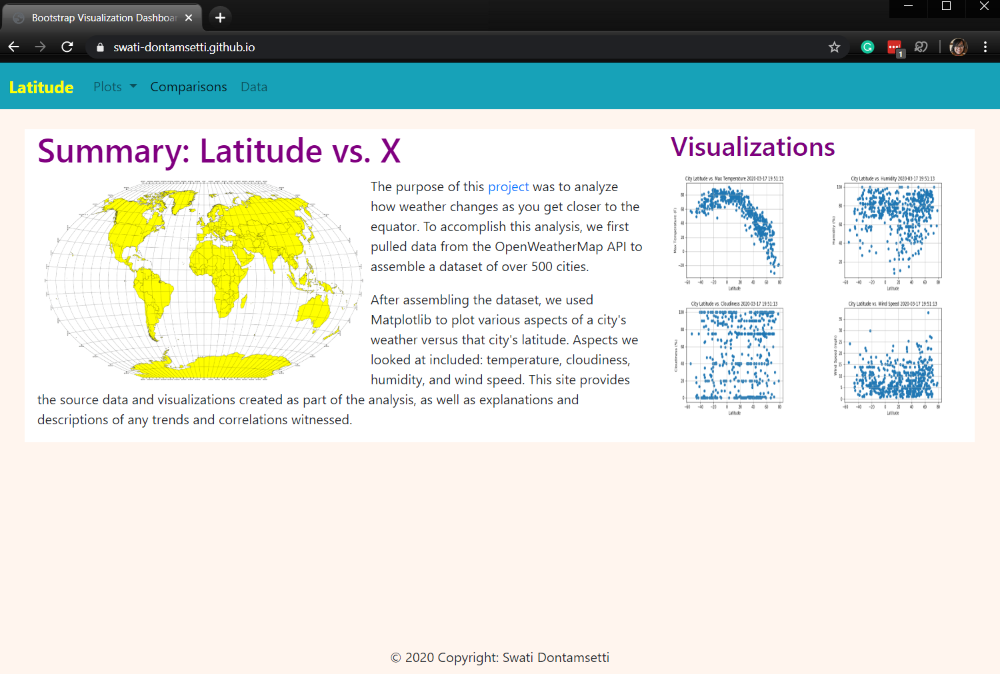
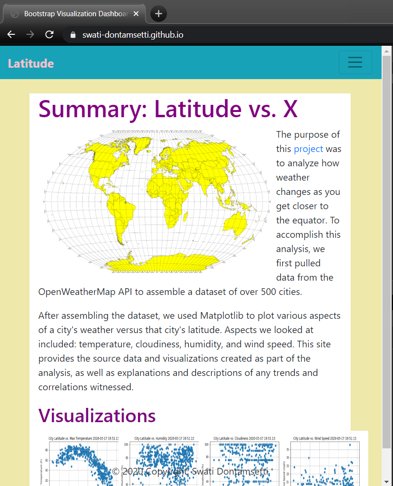
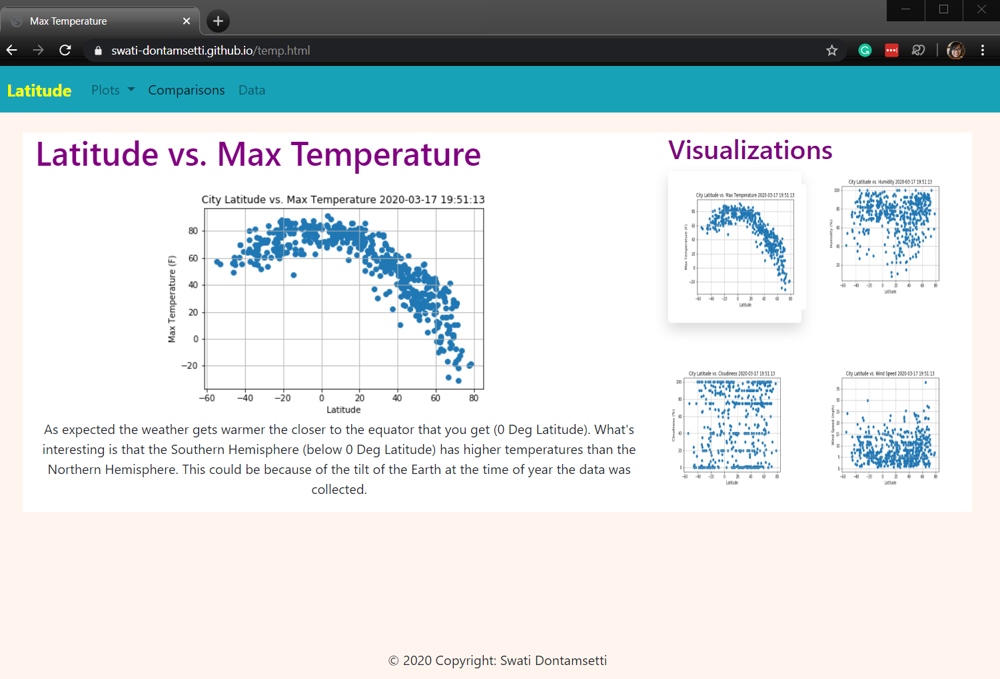
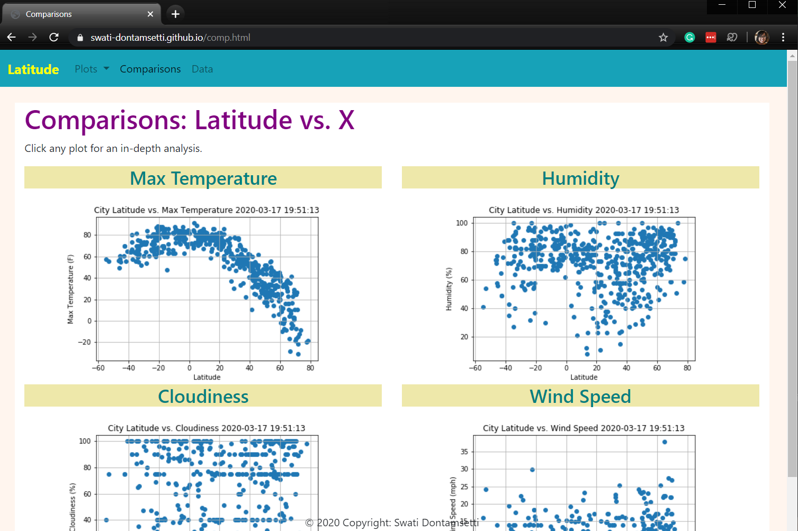
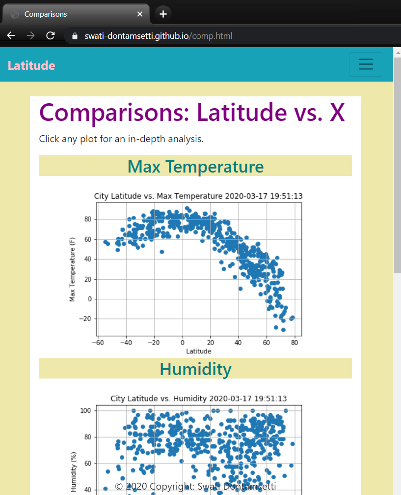
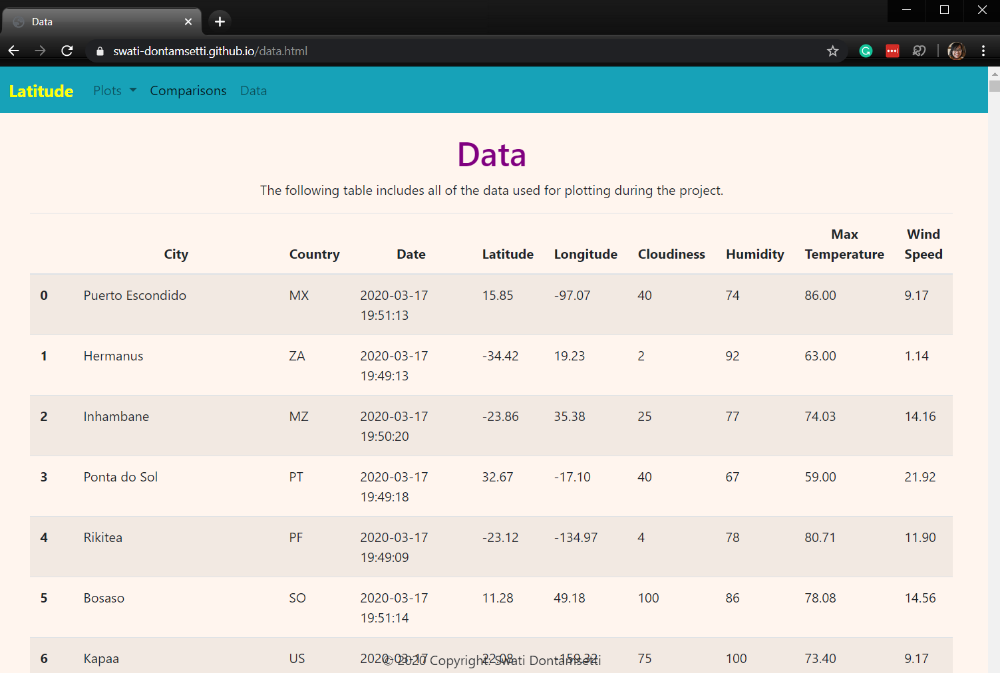

# Web Visualization Dashboard (Latitude)

## Background

Data is more powerful when we share it with others! Let's take what we've learned about HTML and CSS to create a dashboard showing off the analysis we've done.

The website can be found here: https://swati-dontamsetti.github.io/Web-Design-Challenge/

## Latitude - Latitude Analysis Dashboard with Attitude

For this homework we'll be creating a visualization dashboard website using visualizations we've created in a past assignment. Specifically, we'll be plotting [weather data](WebVisualizations/assets/cities.csv).

In building this dashboard, we'll create individual pages for each plot and a means by which we can navigate between them. These pages will contain the visualizations and their corresponding explanations. We'll also have a landing page, a page where we can see a comparison of all of the plots, and another page where we can view the data used to build them.

### Website Requirements

The website must consist of 7 pages total, including:

* A **landing page** containing:
  * An explanation of the project.
  * Links to each visualizations page.
  
Large:

Small:

* Four **visualization pages**, each with:
  * A descriptive title and heading tag.
  * The plot/visualization itself for the selected comparison.
  * A paragraph describing the plot and its significance.

* A **comparisons page** that:
  * Contains all of the visualizations on the same page so we can easily visually compare them.
  * Uses a bootstrap grid for the visualizations.
    * The grid must be two visualizations across on screens medium and larger, and 1 across on extra-small and small screens.
    
Large:

Small:

* A **data page** that:
  * Displays a responsive table containing the data used in the visualizations.
    * The table must be a bootstrap table component. [Hint](https://getbootstrap.com/docs/4.3/content/tables/#responsive-tables)
    * The data must come from exporting the `.csv` file as HTML, or converting it to HTML. Try using a tool you already know, pandas. Pandas has a nifty method approprately called `to_html` that allows you to generate a HTML table from a pandas dataframe. See the documentation [here](https://pandas.pydata.org/pandas-docs/version/0.17.0/generated/pandas.DataFrame.to_html.html)

The website must, at the top of every page, have a navigation menu that:
* Has the name of the site on the left of the nav which allows users to return to the landing page from any page.
* Contains a dropdown on the right of the navbar named "Plots" which provides links to each individual visualization page.
* Provides two more links on the right: "Comparisons" which links to the comparisons page, and "Data" which links to the data page.
* Is responsive (using media queries): notice the background color change.

Finally, the website must be deployed to GitHub pages.

### Considerations
* You must use bootstrap. This includes using the bootstrap `navbar` component for the header on every page, the bootstrap table component for the data page, and the bootstrap grid for responsiveness on the comparison page.
* You must deploy your website to GitHub pages, with the website working on a live, publicly accessible URL as a result.
* Be sure to use a CSS media query for the navigation menu.
* Be sure your website works at all window widths/sizes.
* Feel free to take some liberty in the visual aspects, but keep the core functionality the same.
